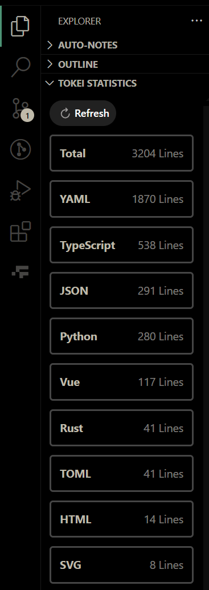

# Tokei Statisitics

A quick extension to count lines of your code, powered by [Tokei](https://github.com/XAMPPRocky/tokei).

Open the sidebar `EXPLORER` and find the tree view panel `TOKEI STATISTICS`.

## Requirements

You need to have [Tokei](https://github.com/XAMPPRocky/tokei) installed and in your PATH. 

In the future, the plugin will install Tokei automatically if it's not found.

## How to configure

[See the documentation](https://github.com/XAMPPRocky/tokei?tab=readme-ov-file#configuration), attach a `tokei.toml` file to your: 

- **project root**: for the current project

- **configuration folder**: for all of your projects

## Author

[Gao Junran](https://github.com/gaojunran)
